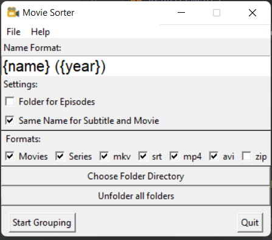
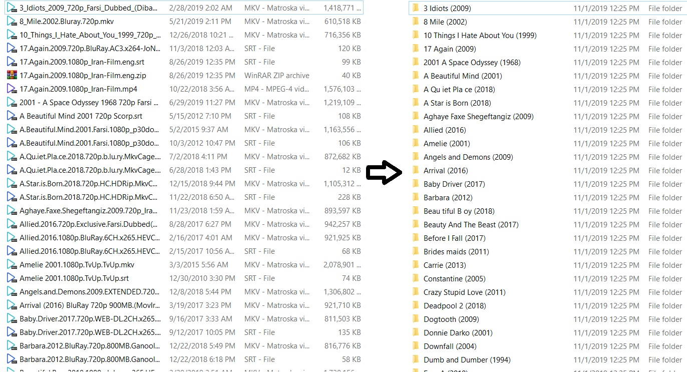

# MovieSorter

## Overview
MovieSorter is a user-friendly application designed to organize your movie collection efficiently. It supports two languages (English/Persian) and offers both GUI and console interfaces. Whether you prefer a visual interface or command-line operations, MovieSorter makes the sorting and organizing process intuitive and straightforward.




## Features
- **Multilingual Support:** Use MovieSorter in English or Persian, catering to a diverse user base.
- **Flexible Interfaces:** Choose between a graphical user interface (GUI) or a console-based interaction, according to your preference or use case.
- **Automated Sorting:** Automatically sort your movies into structured directories based on various metadata, such as movie name, year, season, and episode.
- **Customizable Settings:** Tailor the sorting logic and directory structure to your needs through easy-to-configure settings.

## Requirements:
Ensure you have Python installed on your system. You can then install the required dependencies via pip:
```bash
pip install -r requirements.txt
```


## Usage
After installation, you can run MovieSorter in two modes:

### GUI Mode
For a graphical interface, execute:
```bash
python GUI.py
```

### Console Mode
For console mode with additional command-line options, execute:
```bash
python console.py --help
```
Refer to the help output for detailed usage instructions and available command-line arguments.

## Contributing
Contributions to MovieSorter are welcome! Feel free to fork the repository, make your improvements, and submit a pull request. 


## License
[MIT](https://opensource.org/licenses/MIT)